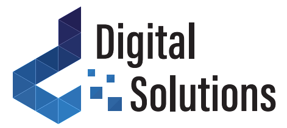
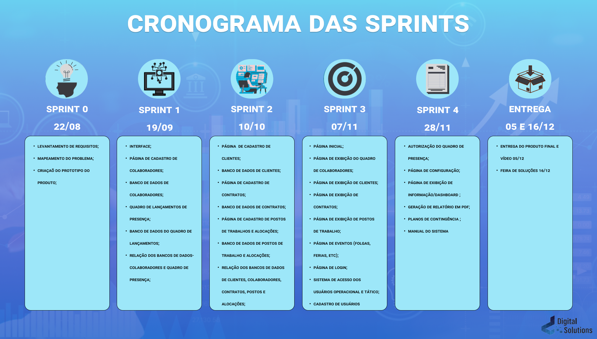
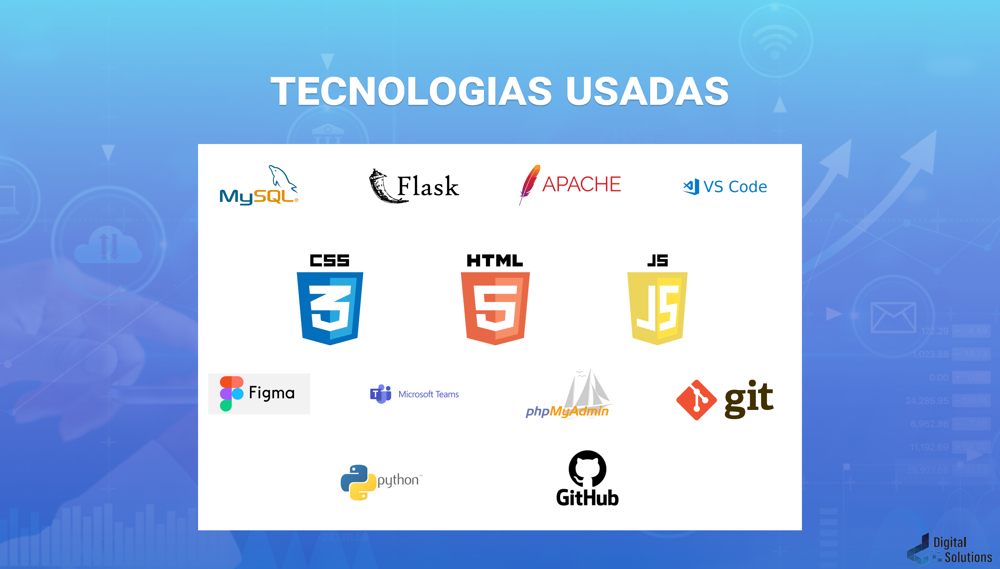
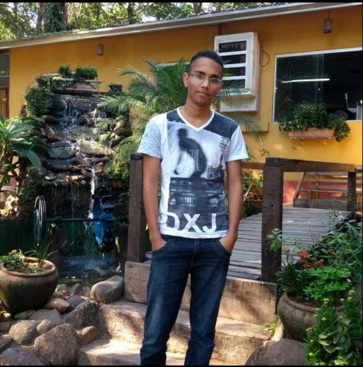

# Aprendizagem-por-Projetos-Integrados-2-SEMESTRE
Projeto Integrador do Grupo Digital Solutions, formado por alunos do 2º semestre de Análise e Desenvolvimento de Sistemas da FATEC São José dos Campos de 2021.

 
 

  <a href ="#o-projeto"> Projeto </a>  • 
  <a href ="#dart-proposta"> Proposta </a>  • 
  <a href ="#calendar-cronograma-das-sprints"> Sprints </a>  • 
  <a href ="#computer-tecnologias-utilizadas"> Tecnologias </a>  • 
  <a href ="#bulb-metodologia-utilizada"> Metodologia </a>  • 
   <a href ="#-product-backlog">Product Backlog </a>  •
  <a href ="#-sprints-backlog">Sprints Backlog </a>  •
  <a href ="#-equipe"> Equipe </a> •
  <a href="https://github.com/JulianaMaria-Lab/Aprendizagem-por-Projetos-Integrados-2-SEMESTRE/blob/main/readme/sprint-4/Manual.pdf">Manual do Site </a>

 

## O Projeto

 

> Status do Projeto: Concluido

 

## :dart: Proposta

**Desenvolver um sistema para os devidos fins da empresa:**  

> **Requisitos**

-  Cadastro de usuários;
-  Cadastro de contratos;
-  Cadastro de clientes;
-  Cadastro de colaboradores;
-  Cadastro de postos de trabalho;
-  Cadastro de alocação;
-  Quadro de presença;
-  Painel adminitrativo para alterações;
-  Emissão de relatorios;

   

> **Requisitos não funcionais**

-  Banco de dados relacional;
-  O sistema deve ter um plano de contingência caso ocorra falhas;
-  O sistema deve ser seguro.
-  O sistema deve ser simples e fácil de usar.

  

## :calendar: Cronograma das Sprints

-  KICK-OFF - 16/08/2021 a 22/08/2021

- [ SPRINT 1 ](https://github.com/JulianaMaria-Lab/Aprendizagem-por-Projetos-Integrados-2-SEMESTRE/tree/main/readme/sprint-1) - 30/08/2021 a 19/09/2021

-  [ SPRINT 2 ](https://github.com/JulianaMaria-Lab/Aprendizagem-por-Projetos-Integrados-2-SEMESTRE/tree/main/readme/sprint-2) - 20/09/2021 a 10/10/2021

-  [ SPRINT 3 ](https://github.com/JulianaMaria-Lab/Aprendizagem-por-Projetos-Integrados-2-SEMESTRE/tree/main/readme/sprint-3) - 18/10/2021 a 07/11/202

-  [ SPRINT 4 ](https://github.com/JulianaMaria-Lab/Aprendizagem-por-Projetos-Integrados-2-SEMESTRE/tree/main/readme/sprint-4) - 08/11/2021 a 28/11/2021

-  Apresentação Final - 29/11/2021 a 05/12/2021

-  [Feira de Soluções](https://youtu.be/xGE51h8fBuY) - 16/12/2021

<h1 align="center"> </h1>

 

## :computer: Tecnologias Utilizadas

<h1 align="center"> </h1>

- **Banco de Dados:** MySQL;
- **Back-end:** Flask, Javascript, Apache, Python;
- **Front-end:** HTML, CSS, JavaScript;
- **Ferramentas:** Visual Studio Code, phpMyAdmin, Figma, Teams, Git e Github;

 

## :bulb: Metodologia Utilizada

- **Metodologia Ágil: SCRUM**
  </h1>

 

## 📋 Product Backlog

<h1 align="center"> </h1>

 

## 📝 Sprints Backlog

<h1 align="center"> </h1>

 

## 👨‍💻 Equipe

 

| Nome                  | Função        | Linkedin                                                                 | GitHub                                         | Avatar                                                          |
| --------------------- | ------------- | ------------------------------------------------------------------------ | ---------------------------------------------- | --------------------------------------------------------------- |
| **Julio Cesar**       | Scrum Master  | [@LinkedIn](https://www.linkedin.com/in/juliocesar2811/)                 | [@GitHub](https://github.com/juliocesar1316)   |                    |
| **Juliana Maria**     | Product Owner | [@LinkedIn](https://www.linkedin.com/in/juliana-maria-a0b0a0124)         | [@GitHub](https://github.com/JulianaMaria-Lab) |             |
| **Francisco Quirino** | Desenvolvedor | [@LinkedIn](https://www.linkedin.com/in/francisco-quirino-4087281b1)     | [@GitHub](https://github.com/ciscoquirino)     |  |
| **Douglas Queiroz**   | Desenvolvedor | [@LinkedIn](https://www.linkedin.com/in/douglas-queiroz-3b9a72212/)      | [@GitHub](https://github.com/douglaswe)        |                   |
| **Richard Rafael**    | Desenvolvedor | [@LinkedIn](https://www.linkedin.com/mwlite/in/richard-soares-002195221) | [@GitHub](https://github.com/Richardrafael)    |                   |

 
