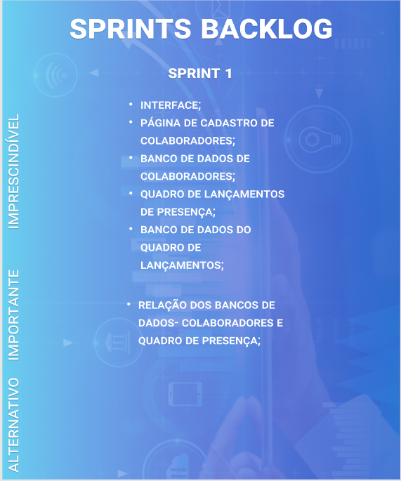
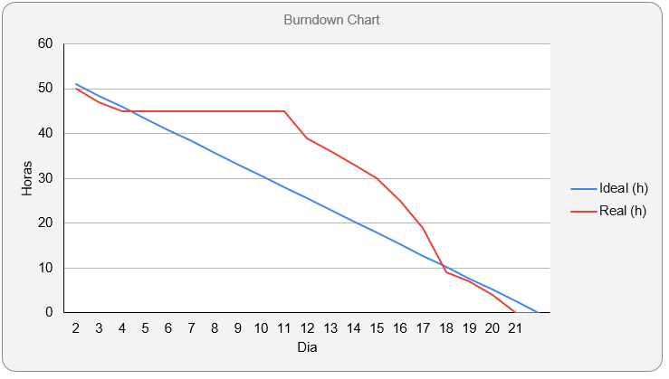
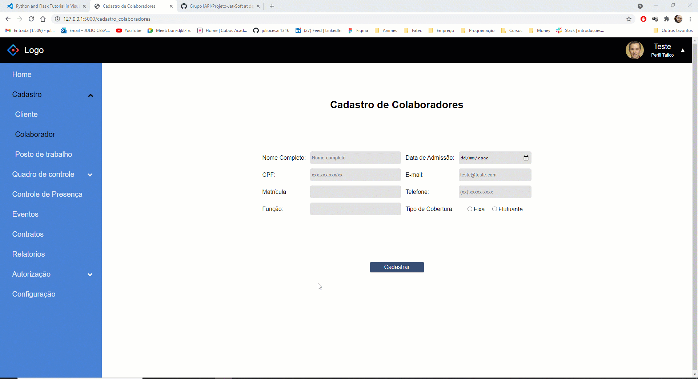
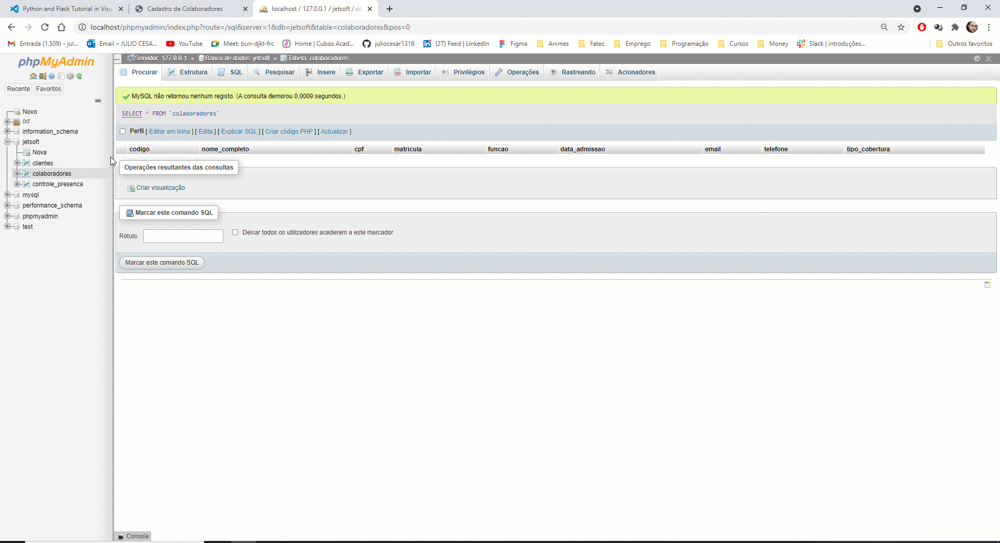

# [Digital Solutions](../Logo.png)

## :ballot_box_with_check: SPRINT 1

Após o cliente aprovar o protótipo apresentado, o desenvolvimento do projeto se baseou em focar no principal objetivo do aplicativo, que é o controle de presença dos colaboradores, desenvolvendo a principio as principais funçoes: controle de presença, cadastro de colaboradores, montagem do banco de dados do colaborador onde ao cadastrar o colaborador, seus dados vao para tabela de colaboradores e de controle de presença.

 

## Sprint Backlog

<h1 align="center"> </h1>
 

## Burndown da Sprint

<h1 align="center"> </h1>

 

## :desktop_computer: Funcionalidades da Sprint

<h3 align="center">Interface</h3>

<h1 align="center"> </h1>

 

<h3 align="center">Cadastro Colaborador</h3>

<h1 align="center"> </h1>

 

<h3 align="center">Controle de Presença</h3>

<h1 align="center"> </h1>

<h3 align="center">Banco de dados</h3>

<h1 align="center"> </h1>
