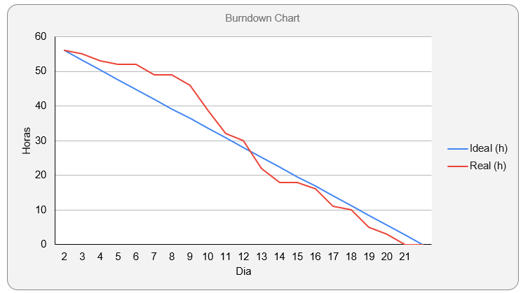
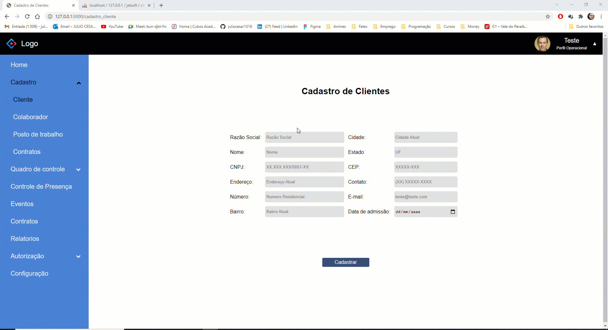
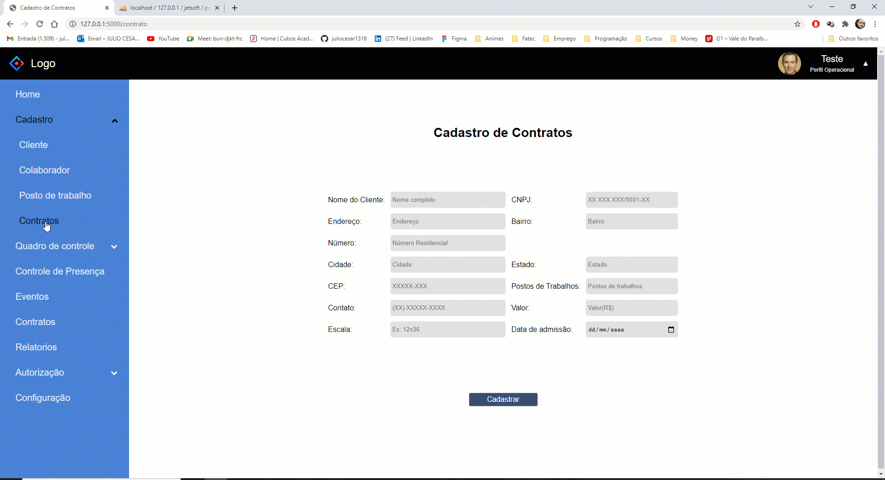
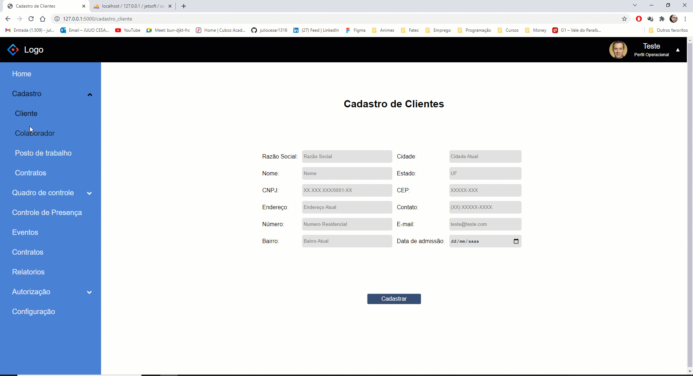
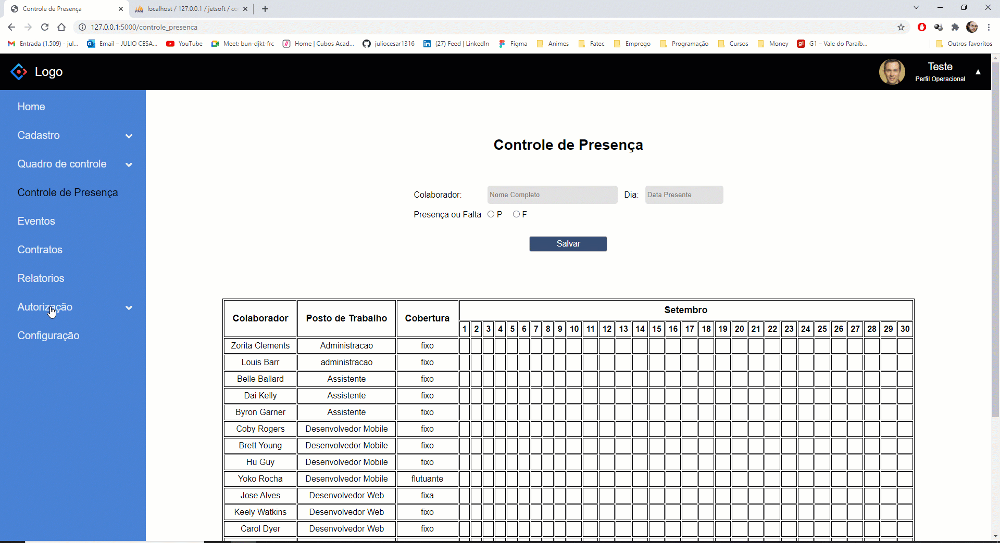

# [Digital Solutions](../Logo.png)

## :ballot_box_with_check: SPRINT 2

Nesta sprint foi realizado a montagem dos formularios de cadastro de clientes, contratos, postos de trabalho e seus devidos banco de dados ja relacionado, onde o mesmo foi programado para os campos de dados serem devidamente preenchidos. No controle de presença foi inserido os postos de trabalho onde o mesmo é agrupado e organizado em postos de trabalho, tipo de cobertura (fixo ou flutuante) e pelo registro do colaborador facilitando na busca de colaboradores fixo e flutuantes pelo postos de trabalho.
 

## Sprint Backlog

<h1 align="center"> </h1>
 

## Burndown da Sprint

<h1 align="center"> </h1>

 

## :desktop_computer: Funcionalidades da Sprint

<h3 align="center">Cadastro de Clientes</h3>

<h1 align="center"> </h1>

 

<h3 align="center">Cadastro de Contratos</h3>

<h1 align="center"> </h1>

 

<h3 align="center">Cadastro de Postos de Trabalho</h3>

<h1 align="center"> </h1>

<h3 align="center">Controle de Presença</h3>

<h1 align="center"> </h1>

<h3 align="center">Banco de Dados</h3>

<h1 align="center"> </h1>
