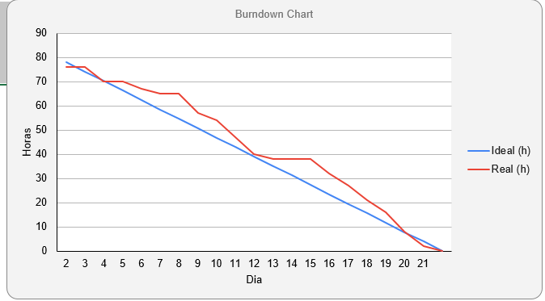
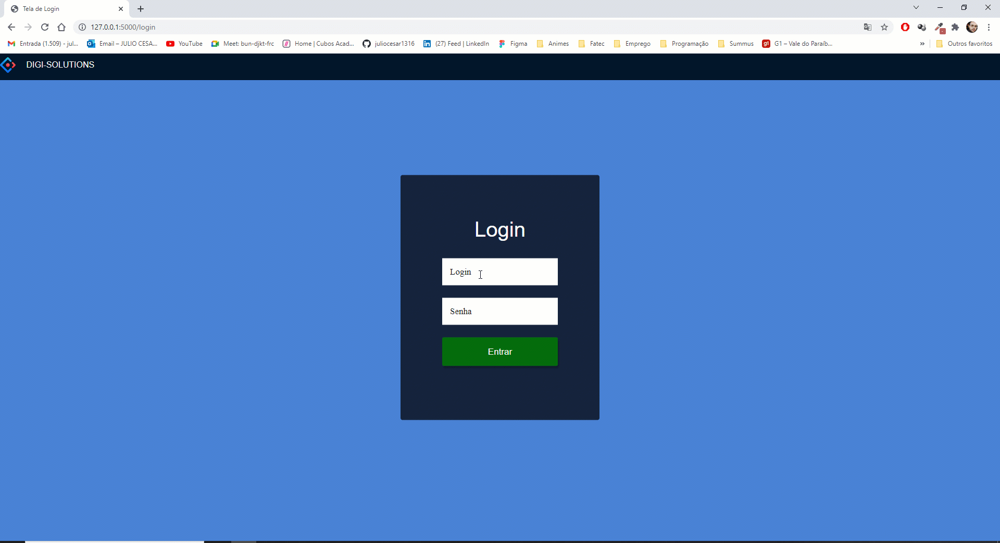
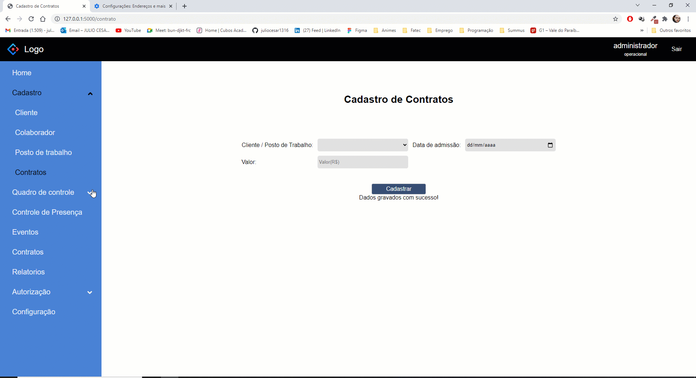

# [Digital Solutions](../Logo.png)

## :ballot_box_with_check: SPRINT 3

Nesta sprint foi realizado a ligação dos bancos de dados onde primeiramente é cadastrado um cliente que gera um id depois é cadastrado o posto de trabalho onde vai liga-lo a um cliente, depois o cadstrado do colaborador onde vai ser ligado ao cliente e um posto de trabalho e por fim o contrato onde vai poder escolher o cliente e o posto de trabalho para realizar o contrato. Foi realizado tambem nessa sprint o login do usuario junto com cadastro do mesmo, as paginas de quadros de colaboradores, postos de trabalho, contratos e clientes, pagina de eventos e uma pagina de dashboard onde ira mostrar os ultimos 10 cadastros de cliente e de posto de trabalho junto com sua infromaçao de quantidade de clientes, postos de trabalho e colaboradores cadstrados no sistema.
 

## Sprint Backlog

<h1 align="center"> </h1>
 

## Burndown da Sprint

<h1 align="center"> </h1>

 

## Cronograma da Sprint Atualizado

<h1 align="center"> </h1>

## :desktop_computer: Funcionalidades da Sprint

<h3 align="center">Login</h3>

<h1 align="center"> </h1>

 

<h3 align="center">Ligação do Banco de Dados</h3>

<h1 align="center"> </h1>

 

<h3 align="center">Quadros de Dados</h3>

<h1 align="center"> </h1>
