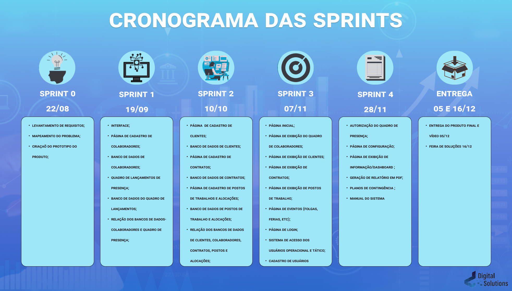

# [Digital Solutions](../Logo.png)

## :ballot_box_with_check: SPRINT 4

Nesta Sprint foi feito uma autorização de rotas onde se o usuário não fizer login ele não terá acesso a outras páginas e além desse travamento pelo login tem duas páginas uma é o cadastro de usuários e de autorização do controle de presença que somente o operador tático pode ter acesso dando erro para o operador operacional.

Foi inserido um método onde o tático na aba de autorização ao apertar para validar e fechar o mês, ele bloqueia a tabela de controle de presença onde nenhum dos operadores poderá cadastrar a presença do colaborador e ao iniciar um novo mês a tabela trocara automaticamente para o mês vigente sendo assim zerando a tabela de presença, mas mantendo seus dados de colaborador.

Foi realizado o deploy da aplicação na plataforma 'pythonanywhere' e foi inserido botões na tabela de contratos onde ao apertar ele fara o download daquele contrato em pdf e na aba de autorização também tem um botão onde ao apertar ele fara o download em pdf da tabela de controle de presença.
 

## Sprint Backlog

<h1 align="center"> </h1>
 

## Burndown da Sprint

<h1 align="center"> </h1>

 

## Cronograma da Sprint Atualizado

<h1 align="center"> </h1>

## :desktop_computer: Funcionalidades da Sprint

### Deploy da Aplicação

<a href="http://digitalsolutions.pythonanywhere.com/">Projeto - Digital Solutions</a>
